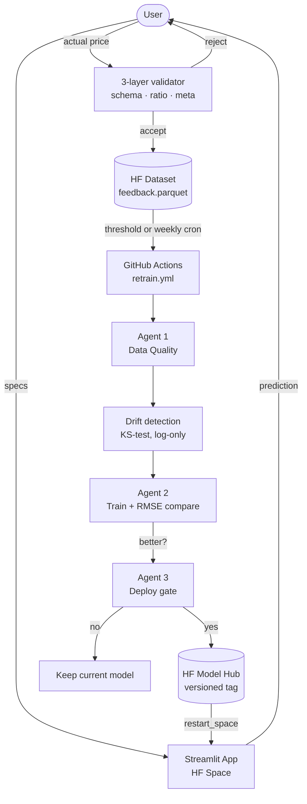

# car-price-mlops

🚗 **End-to-end MLOps pipeline for US used-car price prediction.** Trained on
552K+ auction records. Continuously retrains itself from validated user
feedback.

[](https://github.com/Osman-Ozcanli/car-price-mlops/actions/workflows/ci.yml)

---

## Live demo

👉 **[HuggingFace Space](https://huggingface.co/spaces/Osman-Ozcanli/car_price_prediction_space)**

Pick a vehicle's specs, get a price estimate, optionally submit the actual
sale price. Every accepted submission feeds the next retraining cycle.

---

## Architecture



---

## Why this is more than a notebook

Most "MLOps" portfolio projects stop at "train model + Streamlit demo." This
one closes the loop:

- **Feedback → validation → dataset:** every user submission is checked by a
  three-layer deterministic guard ([`common/validation.py`](common/validation.py)).
  Bad data never enters training.
- **Threshold trigger + weekly cron:** retraining fires on either every Nth
  feedback row or every Sunday — two channels so neither is the single point
  of failure.
- **Deploy gate:** a new model is published only if its RMSE beats the current
  model's on the same validation slice. Bad retrains don't reach users.
- **Versioned rollback target:** every deploy snapshots the previous model
  as `lgbm_tuned_prev.pkl`. Used today for A/B labelling, available tomorrow
  for rollback.
- **Keep-alive cron:** a daily ping prevents the free-tier Space from
  cold-starting in front of users.

---

## Model

| Field | Value |
|---|---|
| Algorithm | LightGBM (Optuna-tuned, 50 trials) |
| Target | Used-car selling price ($500–$78,000) |
| Test RMSE | ~$1,814 |
| Inflation adjustment | ×1.38 multiplier (2015 → 2025) |
| Numeric features | `age`, `odometer`, `condition`, `age_x_odo` |
| Ordinal features | `body`, `transmission`, `color`, `interior` |
| Target-encoded features | `make`, `model`, `trim`, `state` |
| Target transform | Yeo-Johnson (inverted at predict time) |

See [CLAUDE.md](CLAUDE.md) for the frozen schema and pipeline order.

---

## Repo layout

```
car-price-mlops/
├── app/                # Streamlit UI
├── common/             # Shared package: transformers, constants, validation
├── training/           # train.py orchestrator, drift.py, original_data.parquet
├── agents/             # data_quality, performance, deploy
├── tests/              # pytest: validation, transformers, constants
├── scripts/            # push_app_to_space.py
├── .github/workflows/  # retrain, deploy_app, keepalive, ci
├── pyproject.toml      # ruff + pytest config
├── requirements.txt
├── CLAUDE.md           # frozen spec
├── progressyeni.md     # live roadmap
└── README.md
```

---

## Run locally

```bash
git clone https://github.com/Osman-Ozcanli/car-price-mlops.git
cd car-price-mlops
pip install -r requirements.txt
streamlit run app/app.py
```

The app downloads model artifacts from the HF Model repo on first run; no
local training data needed.

### Run tests

```bash
pip install pytest ruff
pytest -q
ruff check . --extend-select=I --ignore=E501
```

### Trigger retraining manually

```bash
gh workflow run retrain.yml
```

(Or via the GitHub UI: Actions → Retrain Pipeline → Run workflow.)

---

## Retraining triggers

| Trigger | When | Mechanism |
|---|---|---|
| Threshold | Every `THRESHOLD` accepted feedback rows | `app.py` dispatches `retrain.yml` via the GitHub API |
| Weekly | Sunday 02:00 UTC | `retrain.yml` cron |
| Manual | On demand | `gh workflow run retrain.yml` or UI |

`THRESHOLD = 10` while in demo mode. Flip to `100` (constants.py) for
production-pace retraining.

---

## Agents

| Agent | Role | On failure |
|---|---|---|
| Data quality | Null + outlier + range check on the feedback batch | Pipeline stops, no retrain |
| Performance | Train candidate, RMSE-compare to active model on shared validation slice | Deploy cancelled |
| Deploy | Snapshot prev model, publish new artifacts, tag version, restart Space | Logs error, no user impact |

The first migration after a schema change is the only case where the legacy
bundle cannot be evaluated — the new model deploys by default in that scenario.

---

## Safety rules

- New model only deployed if `new_rmse < old_rmse` (or first-migration default deploy).
- `original_data.parquet` is never modified.
- Feedback validated by three layers ([`common/validation.py`](common/validation.py))
  before reaching the dataset.
- Drift detection (KS-test, p<0.05) runs each retrain and logs to the run log.
- Every deploy tagged `vYYYYMMDD` on the HF Model repo.

---

## HuggingFace resources

| Resource | Repo |
|---|---|
| Model | `Osman-Ozcanli/car_price_prediction` |
| Feedback dataset | `Osman-Ozcanli/car_price_prediction_feedback` |
| Space | `Osman-Ozcanli/car_price_prediction_space` |

---

## Tech stack

| Need | Tool |
|---|---|
| UI | Streamlit |
| Model | LightGBM |
| Hyperparameter tuning | Optuna |
| Model registry | HuggingFace Model Hub |
| Data storage | HuggingFace Datasets (Parquet) |
| Drift detection | scipy (`ks_2samp`) |
| Scheduler | GitHub Actions |
| Versioning | HF model tags + per-deploy `deploy_meta.json` |
| Lint / test | ruff + pytest |

---

## Required secrets

**GitHub Secrets** (used by retrain.yml, deploy_app.yml, keepalive.yml):
```
HF_TOKEN       HuggingFace write token (model + dataset + space)
HF_USERNAME    Osman-Ozcanli
```

**HuggingFace Space Secrets** (used by app.py at runtime):
```
HF_TOKEN       Write the feedback dataset
GITHUB_TOKEN   External PAT with workflow:write scope. NOT the auto-issued
               Actions token — that one cannot dispatch other workflows.
```
